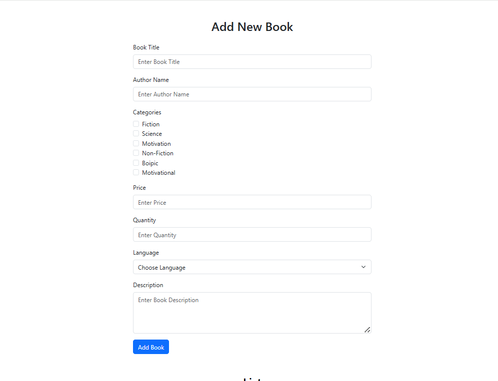
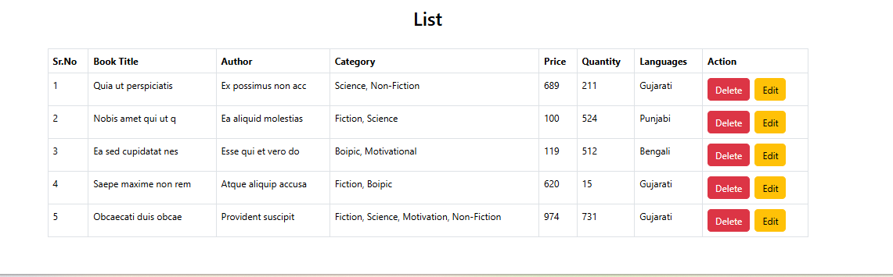

# 📚 Book Management System

A React.js based Book Management System that allows users to add, update, delete, and manage book records with validation and Local Storage support.

---

## 🚀 Features

- Add New Book
- Update Existing Book
- Delete Book
- Form Validation
- Multiple Category Selection
- Language Selection
- Dynamic Book Listing
- Local Storage Integration
- Responsive UI using Bootstrap

---

## 🛠️ Technologies Used

- React.js
- JavaScript (ES6)
- Bootstrap 5
- HTML5
- CSS3
- Local Storage

---

## 📸 Project Screenshots


### Add Book Form



### Book List



### Update Book


---

## 🎥 Project Presentation Video


https://drive.google.com/file/d/1nF0Q7B7FeabVUW0SP78U6dwbl8KT0PoU/view?usp=sharing

---

## 📋 Book Information

Users can manage:

- Book Title
- Author Name
- Categories
- Price
- Quantity
- Language
- Description

---

## ✅ Validation

The application validates:

- Book Title
- Author Name
- Category Selection
- Price
- Quantity
- Language
- Description

---

## 🔄 CRUD Operations

### Create
Add new book records.

### Read
Display books in a dynamic table.

### Update
Edit existing book information.

### Delete
Remove books from the list.

---

## 💾 Local Storage

All book records are stored in browser Local Storage, allowing data to remain available even after page refresh.

---

## ⚙️ Installation

Clone the repository:

```bash
git clone https://github.com/dev-dhamandadiya/pr-Localbox-Miner-react.js.git
```

Install dependencies:

```bash
npm install
```

Run the project:

```bash
npm run dev
```

---

## 📚 React Concepts Used

- useState
- useEffect
- Form Handling
- Controlled Components
- Conditional Rendering
- Array Methods
- CRUD Operations
- Local Storage

---

## 👩‍💻 Author

**Diya Dhamanda**

GitHub:
https://github.com/dev-dhamandadiya

---

## 📄 License

This project is created for learning and educational purposes.